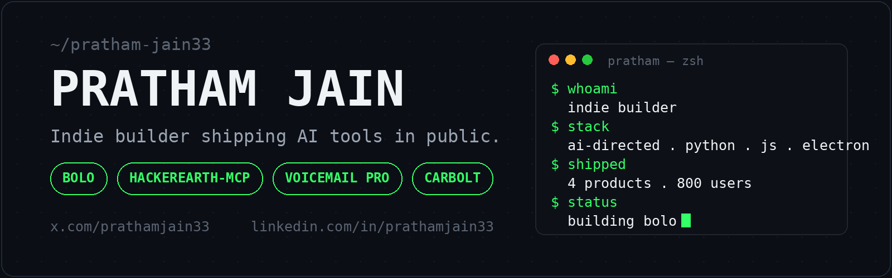

  

### Currently building
**[Bolo](https://github.com/pratham-jain33/Bolo)** — a voice operating layer for your computer. You speak, it does.

### Shipped
- **[hackerearth-mcp](https://github.com/pratham-jain33/hackerearth-mcp)** — give any AI assistant a code run button. 24 languages, powered by HackerEarth's sandbox.
   
  
  
   
  [PyPI](https://pypi.org/project/hackerearth-mcp/) · [Glama](https://glama.ai/mcp/servers/pratham-jain33/hackerearth-mcp)
- **[VoiceMail Pro](https://github.com/pratham-jain33/VoiceMail-Pro)** — browser extension that turns voice dictation into professional emails. 200 users.
- **Carbolt** — browser extension that makes your carbon footprint visible across food, water and fuel. 600 users.

### How I build
`idea → prompt → review → ship → repeat`

I don't write code the traditional way. I direct AI, judge the output, and ship fast. Taste is the moat.

### Tools

  

### Find me
[X](https://x.com/prathamjain33) · [LinkedIn](https://www.linkedin.com/in/prathamjain33/)

---

  
  
  

